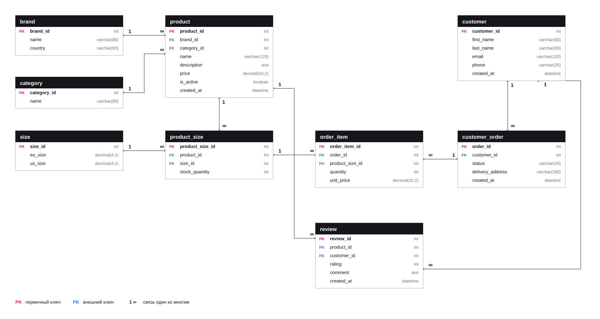
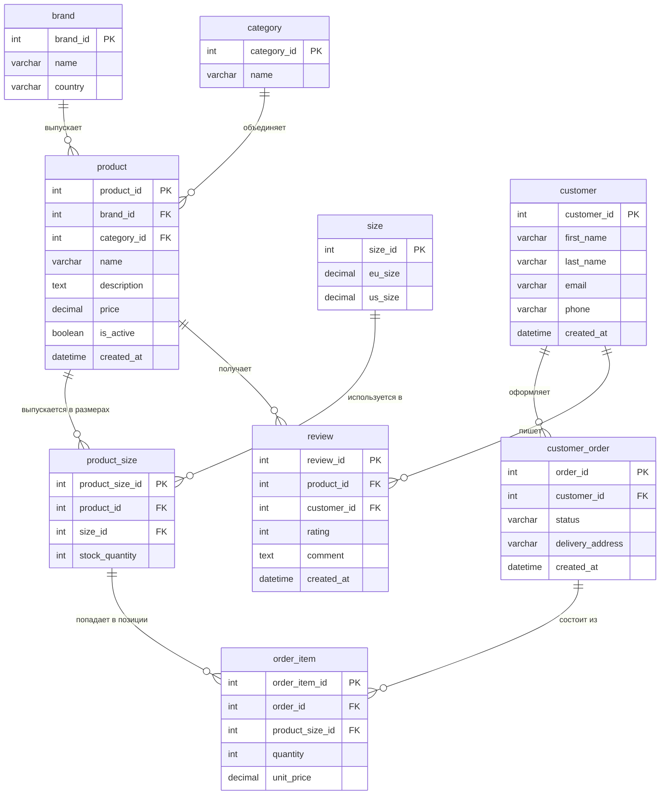

# Практическая работа №4. Проектирование базы данных

Схема базы данных для интернет-магазина кроссовок Dream Sneakers, то есть для того же
сайта, который верстался в первой практической работе. Девять таблиц, связи один ко многим
и две связи многие ко многим через промежуточные таблицы, нормализация до третьей нормальной
формы.

## Содержание

1. [Быстрый старт](#быстрый-старт)
2. [ER-диаграмма](#er-диаграмма)
3. [Описание решения](#описание-решения)
4. [Теоретическая часть](#теоретическая-часть)
5. [Ответы на вопросы](#ответы-на-вопросы)

## Быстрый старт

Диаграмма лежит картинкой, открывается в браузере без всего:

```bash
start "" "Solution/er-diagram.svg"
```

Описание таблиц и связей текстом:

```bash
start "" "Solution/database-description.md"
```

Если нужен локальный сервер, из корня репозитория:

```bash
cd "Task 4th Database Design/Solution" && python -m http.server 8000
```

## ER-диаграмма



Та же схема в текстовом виде, GitHub рисует её сам:



## Описание решения

```
Solution/
    er-diagram.svg            ER-диаграмма картинкой
    er-diagram.mmd            та же диаграмма исходником для Mermaid
    database-description.md   описание таблиц, связей и нормализации
```

Полное описание всех девяти таблиц с полями, типами и ключами лежит в
[database-description.md](Solution/database-description.md), здесь только логика, по которой
схема собиралась.

Предметную область я взял из первой работы: магазин кроссовок с каталогом, карточками
товаров, заказами и отзывами. Отсюда набор сущностей: бренд, категория, модель, размер,
остаток по размеру, покупатель, заказ, позиция заказа, отзыв.

Бренд и категория вынесены из таблицы моделей в отдельные справочники. Если хранить название
бренда прямо в карточке товара, оно повторится столько раз, сколько у бренда моделей, и при
переименовании придётся править все записи. Это классическая транзитивная зависимость, из-за
которой схема не дотягивает до третьей нормальной формы.

Размеры это отдельная история. Одна модель выпускается в десятке размеров, один размер
встречается у всех моделей, то есть связь многие ко многим. Разложена она через таблицу
`product_size`, и это не формальность: у связи есть собственный атрибут, остаток на складе.
Именно пара «модель плюс размер» лежит на складе и продаётся, поэтому позиция заказа
ссылается не на модель, а на `product_size`.

Вторая связь многие ко многим это заказы и товары, она разложена через `order_item`. Там
тоже есть атрибуты связи, количество пар и цена за пару.

Пара решений, которые я принял сознательно и которые видно в схеме.

Таблица заказов названа `customer_order`, а не `order`, потому что `ORDER` в SQL
зарезервированное слово и запросы пришлось бы писать с кавычками вокруг имени таблицы.

Сумма заказа нигде не хранится, она считается по позициям. Вычисляемое поле пришлось бы
пересчитывать при каждом изменении состава заказа, и любая пропущенная правка означала бы
расхождение данных.

Цена в позиции заказа `unit_price` хранится, хотя цена есть и в карточке товара. Это не
дублирование: в каталоге лежит текущая цена, а в заказе нужна та, по которой человек
фактически купил. Через месяц после смены ценника старый заказ должен показывать свою сумму,
а не новую.

## Теоретическая часть

### Основные понятия

**База данных** это организованное хранилище информации, устроенное так, чтобы данные можно
было быстро находить, изменять и защищать от потери и противоречий. Работой с ней управляет
СУБД: MySQL, PostgreSQL, SQLite и другие.

В реляционной модели данные лежат в таблицах.

**Таблица** это набор строк и столбцов, описывающий одну сущность предметной области:
товары, покупатели, заказы.

**Поле (атрибут)** это столбец таблицы, отдельное свойство сущности. У поля есть тип данных,
который определяет, что в нём можно хранить: целое число, строку ограниченной длины, текст,
дату, логическое значение.

**Запись** это строка таблицы, то есть один конкретный объект: одна модель кроссовок, один
покупатель, один заказ.

**Первичный ключ (Primary Key)** это поле или набор полей, которые однозначно определяют
запись. Значения ключа не повторяются и не могут быть пустыми.

**Внешний ключ (Foreign Key)** это поле, которое ссылается на первичный ключ другой таблицы.
Он связывает таблицы между собой и не даёт появиться записи, ссылающейся в пустоту.

### Типы связей

**Один к одному (1:1).** Одной записи первой таблицы соответствует ровно одна запись второй.
Встречается редко, обычно когда часть полей выносят в отдельную таблицу, например редко
используемые или конфиденциальные данные.

**Один ко многим (1:M).** Одна запись связана с несколькими записями другой таблицы, а те, в
свою очередь, с одной. Самый частый тип. Реализуется внешним ключом на стороне «многих»: в
таблице моделей лежит `brand_id`, а не наоборот.

**Многие ко многим (M:M).** Записи с обеих сторон связаны с множеством записей другой
таблицы. Напрямую в реляционной модели такая связь не хранится, её раскладывают на две связи
один ко многим через промежуточную (связующую) таблицу, в которой лежат внешние ключи на обе
стороны, а иногда и собственные атрибуты связи.

### Нормализация

Нормализация это приведение структуры базы к виду, в котором нет дублирования данных и
противоречий. Она выполняется последовательно, по нормальным формам.

**Первая нормальная форма** требует, чтобы все значения были атомарны. Список размеров через
запятую в одной ячейке или поле «ФИО» вместо отдельных имени и фамилии её нарушают.

**Вторая нормальная форма** требует, чтобы каждое неключевое поле зависело от всего
первичного ключа, а не от его части. Актуально для составных ключей.

**Третья нормальная форма** запрещает транзитивные зависимости, когда неключевое поле
зависит от другого неключевого. Классический пример: хранить в таблице товаров и `brand_id`,
и название бренда. Название зависит от бренда, а не от товара, поэтому его выносят в
отдельную таблицу.

Смысл всего этого простой: убрать повторяющиеся данные, чтобы изменение делалось в одном
месте, и исключить ситуацию, когда в разных строках об одном и том же написано разное.

### ER-диаграмма

ER-диаграмма (Entity-Relationship, «сущность-связь») это графическое представление структуры
базы данных. Сущности изображаются прямоугольниками с перечнем атрибутов, связи между ними
линиями, а на концах линий проставляется мощность связи: единица со стороны «один» и знак
бесконечности или «птичья лапка» со стороны «многих». Диаграмма нужна, чтобы структуру можно
было целиком увидеть и обсудить до того, как база создана.

## Ответы на вопросы

**1. Что такое база данных?**

Организованное хранилище информации, устроенное так, чтобы данные можно было быстро искать,
добавлять, изменять и удалять, не теряя целостности. В реляционной модели данные хранятся в
связанных между собой таблицах, а управляет ими СУБД, которая отвечает за доступ, целостность
и одновременную работу нескольких пользователей.

**2. Что такое первичный ключ?**

Поле или набор полей, однозначно определяющих запись в таблице. Значение первичного ключа
уникально в пределах таблицы и не может быть пустым. Обычно берут отдельное числовое поле с
автоинкрементом, например `product_id`, потому что такое значение не зависит от предметной
области и не поменяется, если данные изменятся.

**3. Для чего используется внешний ключ?**

Чтобы связать таблицы. Внешний ключ хранит значение первичного ключа другой таблицы и тем
самым указывает, к какой записи относится текущая. Кроме связи он обеспечивает ссылочную
целостность: СУБД не даст добавить заказ несуществующего покупателя и не даст удалить
покупателя, у которого есть заказы, пока не будет задано, что делать с зависимыми записями.

**4. Какие существуют типы связей между таблицами?**

Три: один к одному (1:1), один ко многим (1:M) и многие ко многим (M:M). Первый встречается
редко и обычно означает вынос части полей в отдельную таблицу. Второй самый
распространённый. Третий напрямую не хранится и всегда раскладывается через связующую
таблицу.

**5. Что такое нормализация данных?**

Процесс приведения структуры базы к виду без дублирования и противоречий. Выполняется по
шагам, от первой нормальной формы к третьей: сначала добиваются атомарности значений, потом
убирают зависимость полей от части составного ключа, потом транзитивные зависимости между
неключевыми полями. Результат в том, что каждый факт хранится ровно в одном месте, поэтому
изменение делается один раз и данные не расходятся.

**6. В чём отличие 1:M и M:M связей?**

При связи один ко многим одна запись главной таблицы связана с множеством записей
подчинённой, но каждая запись подчинённой относится ровно к одной главной. Для неё
достаточно внешнего ключа на стороне «многих».

При связи многие ко многим записи с обеих сторон могут быть связаны с множеством записей
другой таблицы. Одним внешним ключом её не выразить, поэтому вводят связующую таблицу с
двумя внешними ключами, и одна связь M:M превращается в две связи 1:M. В этой работе так
сделаны `product_size` и `order_item`.

**7. Что такое ER-диаграмма?**

Схема «сущность-связь», графическое описание структуры базы данных. Сущности рисуются
прямоугольниками с перечнем атрибутов и пометками ключей, связи между ними линиями с
указанием мощности. Диаграмма позволяет увидеть всю структуру целиком и проверить логику
связей до того, как база будет реально создана.
